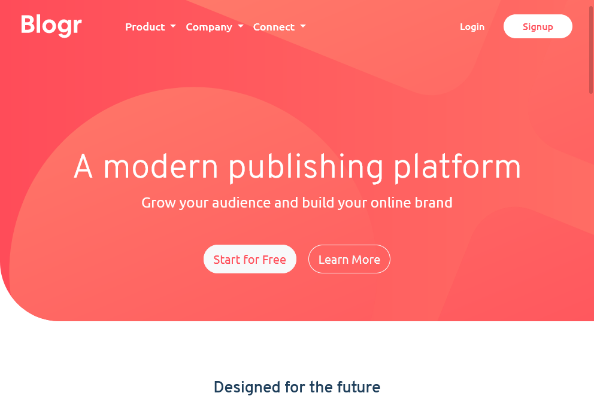

# Frontend Mentor - Blogr landing page solution

This is a solution to the [Blogr landing page challenge on Frontend Mentor](https://www.frontendmentor.io/challenges/blogr-landing-page-EX2RLAApP). Frontend Mentor challenges help you improve your coding skills by building realistic projects. 

## Table of contents

- [Frontend Mentor - Blogr landing page solution](#frontend-mentor---blogr-landing-page-solution)
  - [Table of contents](#table-of-contents)
  - [Overview](#overview)
    - [The challenge](#the-challenge)
    - [Screenshot](#screenshot)
    - [Links](#links)
  - [My process](#my-process)
    - [Built with](#built-with)
  - [Author](#author)

## Overview

### The challenge

Users should be able to:

- View the optimal layout for the site depending on their device's screen size
- See hover states for all interactive elements on the page

### Screenshot

### Links

- Solution URL: [Code](https://github.com/ayearicks/blogr-landing-page-main)
- Live Site URL: [Live](http://yearicks.dev/blogr-landing-page-main/)

## My process

### Built with

- Semantic HTML5 markup
- CSS custom properties
- Bootstrap v5
- Flexbox

## Author

- Website - [Ashley Yearicks](https://www.yearicks.dev)
- Twitter - [@jessarin5](https://www.twitter.com/jessarin5)

